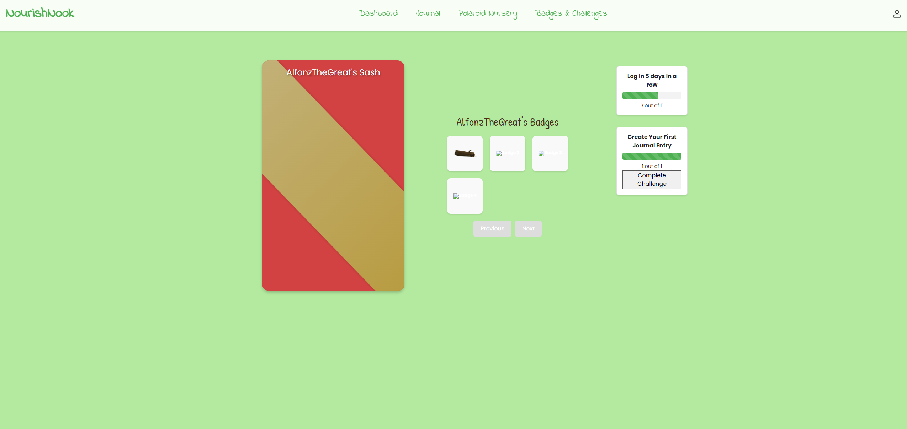

# NourishNook

NourishNook is a web application designed to help users achieve their health goals by tracking their food intake, monitoring their progress, and providing personalized insights. Users can log their meals, earn badges, see their plant grow as they eat more fruits and vegetables, and journal their food intake with a rich text editor.


## Project Screenshots

### Homepage


### Dashboard


### Food Journal


### Badges & Challenges



## Features

- **Track Your Food**: Log meals, snacks, and food feelings with a food journal.
- **See Your Plant Grow**: Earn badges and see your plant grow as you eat more fruits and vegetables.
- **Personalized Insights**: View your fruit and vegetable tracking numbers and see your previous plants.
- **Food Journal**: Use a rich text editor to journal your food intake, with options to change fonts, sizes, and other formatting options.
- **Sticker Banks**: Drag and drop stickers from the banks into the journal to make entries more visual and engaging.
- **User Dashboard**: Access a personalized dashboard with options to add journal entries, view challenges and badges, and visit the Polaroid Nursery.
- **Polaroid Nursery**: Capture and archive daily snapshots of your weekly wellness flower.

## Technologies Used

- **React**: For building the user interface.
- **Quill**: For the rich text editor in the food journal.
- **@dnd-kit**: For drag-and-drop functionality.
- **React Router**: For client-side routing.
- **Bootstrap**: For responsive and mobile-first styling.

## Installation

1. **Clone the repository**:
    ```sh
    git clone https://github.com/yourusername/nourish_nook.git
    cd nourish_nook
    ```

2. **Install dependencies**:
    ```sh
    npm install
    ```

3. **Start the development server**:
    ```sh
    npm start
    ```

4. Open your browser and navigate to `http://localhost:3000` to see the app in action.

## Usage

- **Home Page**: View the main features and start your journey by clicking "Join Today".
- **Login/Sign Up**: Create a new account or log in to access your personalized dashboard.
- **User Dashboard**: View your weekly wellness flower, add journal entries, view challenges/badges, and visit the Polaroid Nursery.
- **Food Journal**: Use the rich text editor to log your food intake, drag and drop stickers, and save or discard your entries.

## Project Structure

- `src/components`: Contains all the React components used in the project.
- `src/styles`: Contains the CSS files for styling the components.
- `public/images`: Contains image assets used in the application.

## Acknowledgements

- **React** for providing a robust framework for building user interfaces.
- **Quill** for the rich text editor.
- **@dnd-kit** for the drag-and-drop functionality.
- **Bootstrap** for responsive design components.
